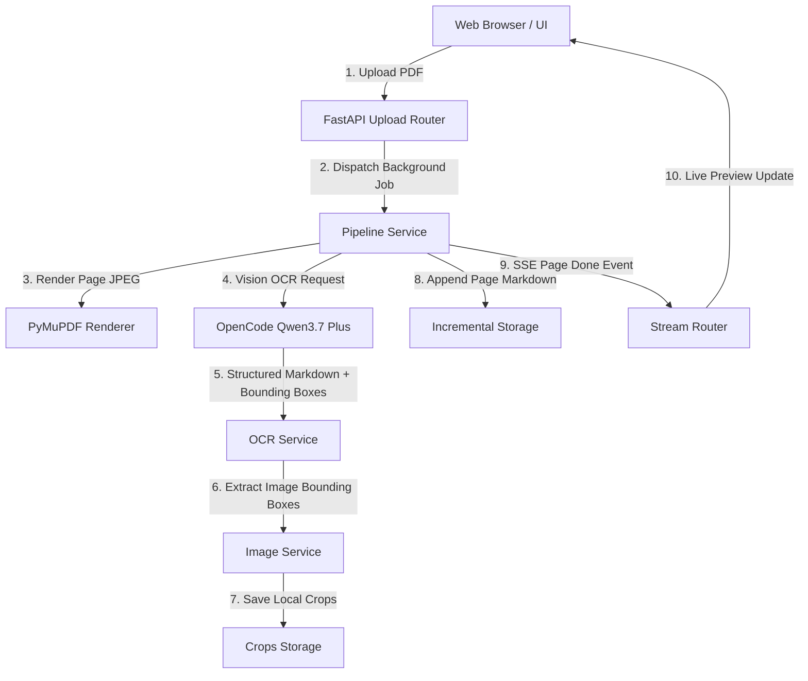

# 📖 Folio — Real-Time PDF to Markdown Converter

[](https://www.python.org/downloads/)
[](https://fastapi.tiangolo.com/)
[](LICENSE)
[](app/)

**Folio** is a minimalist, Apple Books–inspired web application that converts PDF books and documents into clean Markdown in real-time — streaming page-by-page progress directly to your browser as it processes.

Powered by **Qwen3.7 Plus** (Vision LLM via OpenCode Go API), Folio natively generates structured Markdown while detecting image bounding boxes, cropping embedded figures locally, and rendering an interactive split-view reader.

---

## 🚀 Features

- ⚡ **Live Real-time Streaming**: Watch each page render in the preview column the moment OCR completes via Server-Sent Events (SSE).
- 📖 **Apple Books-Inspired UI**: Clean split-pane layout featuring original PDF page navigation on the left and live Markdown reading view on the right.
- 🖼️ **Smart Local Image Cropping**: Embedded figures, photos, and charts are detected by vision bounding box coordinates, cropped locally via Pillow, downscaled, and embedded as Markdown image references.
- 📊 **Telemetry Panel**: Live tracking of pages completed, total OCR duration, average processing time per page, and elapsed execution time.
- 💾 **Crash-Safe Incremental Persistence**: Page markdown is saved to disk as soon as it is processed, protecting progress against unexpected interrupts.
- ⬇️ **Markdown & Asset Export**: One-click download of finalized `.md` files complete with document headers and relative image paths.
- 🏗️ **Clean Modular Architecture**: Modular FastAPI backend (`app/`) paired with native browser ES modules (`static/js/`) for maintainability and feature expansion.

---

## 🏛️ System Architecture



---

## 📦 Directory Structure

```
pdf-to-epub/
├── app/                         # Backend Python Package
│   ├── api/
│   │   └── routes/              # FastAPI Router Endpoints (upload, stream, preview, assets)
│   ├── clients/                 # Decoupled 3rd-party integrations (Qwen API, PyMuPDF)
│   ├── core/                    # Security & helper utilities
│   ├── models/                  # Pydantic schemas (OCR result, sessions, telemetry)
│   ├── services/                # Business logic (pipeline, PDF, OCR, crops, sessions)
│   ├── config.py                # Pydantic/dotenv settings manager
│   └── main.py                  # FastAPI application entrypoint
├── static/                      # Modular Frontend Static Assets
│   ├── css/                     # Design tokens, resets, component styles
│   └── js/                      # Native ES6 Modules (state, SSE, components)
├── templates/
│   └── index.html               # Clean HTML template
├── crops/                       # Extracted cropped images per job
├── outputs/                     # Final generated Markdown files
├── uploads/                     # Uploaded PDF files
├── .env.example                 # Environment variables template
├── CHANGELOG.md                 # Project release history
├── CONTRIBUTING.md              # Guidelines for contributors
├── LICENSE                      # MIT License
├── requirements.txt             # Python dependencies
└── server.py                    # Application entrypoint runner
```

---

## ⚙️ Quick Start

### 1. Prerequisites
- Python **3.10** or higher
- An **OpenCode API Key** ([Get one at opencode.ai](https://opencode.ai/auth))

### 2. Installation

Clone the repository and install dependencies:

```bash
git clone https://github.com/your-username/pdf-to-epub.git
cd pdf-to-epub

# Create and activate virtual environment
python -m venv .venv
source .venv/bin/activate        # On macOS/Linux
.\.venv\Scripts\activate         # On Windows

# Install dependencies
pip install -r requirements.txt
```

### 3. Environment Configuration

Copy the example environment file and set your API key:

```bash
cp .env.example .env
```

Edit `.env`:
```env
OPENCODE_API_KEY=your-opencode-api-key-here
```

### 4. Running the Application

Launch the server:

```bash
python server.py
```

Open your browser and navigate to:
```
http://localhost:8765
```

---

## 🔌 API Reference

| Endpoint | Method | Description |
| :--- | :--- | :--- |
| `GET /` | `GET` | Serves the main web UI |
| `POST /api/upload` | `POST` | Upload PDF file with optional title/author metadata |
| `GET /api/stream/{job_id}` | `GET` | SSE stream emitting `progress`, `page_done`, and `done` events |
| `GET /api/preview/{job_id}/{page}` | `GET` | Renders a specific PDF page as WebP for UI preview |
| `GET /api/pdf_info/{job_id}` | `GET` | Returns PDF page count and document metadata |
| `GET /download/{job_id}` | `GET` | Downloads the generated `.md` file |
| `GET /crops/{job_id}/{filename}` | `GET` | Serves cropped figure images |
| `GET /api/telemetry/{job_id}` | `GET` | Returns processing metrics and timing statistics |

---

## 🤝 Contributing

Contributions are welcome! Please see our [CONTRIBUTING.md](CONTRIBUTING.md) guide for guidelines on submitting issues, setting up the development environment, and creating pull requests.

---

## 📄 License

This project is licensed under the MIT License — see the [LICENSE](LICENSE) file for details.
