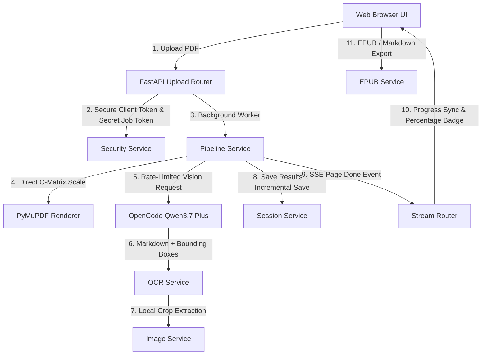

# 📖 Folio — Real-Time PDF to Markdown & EPUB Converter

[](https://www.python.org/downloads/)
[](https://fastapi.tiangolo.com/)
[](https://github.com/prvn2004/pdf-to-epub-ai/actions)
[](LICENSE)
[](app/)

**Folio** is a minimalist, failproof web application that converts PDF books and documents into clean **Markdown** and **EPUB v3 eBooks** in real-time — streaming progress directly to your browser as it processes.

Powered by **Qwen3.7 Plus** (Vision LLM via OpenCode API), Folio natively generates structured Markdown while detecting figure bounding boxes, cropping embedded images locally, and assembling styled eBooks.

---

## 🎨 Design System & Theme

Folio features a **Claude-inspired warm amber & book paper design system**:
- **Warm Paper Aesthetics**: Soft `#fbf7f0` paper background paired with warm `#d97706` amber accents and `#1c1917` warm dark mode.
- **Mobile Responsive**: Fully responsive layout optimized for smartphones, tablets, and desktop displays.
- **Centered Conversion Card**: Clean dropzone, progress card with real-time percentage badges, and format selectors.

---

## 🚀 Key Features

- ⚡ **Real-time Event Streaming**: Stream page completion progress via Server-Sent Events (SSE).
- 📚 **EPUB v3 & Markdown Downloads**: Generate valid `.epub` eBooks (with embedded figures and CSS styling) or raw `.md` documents anytime during or after conversion.
- 🔗 **URL State Recovery (`/?job=SECRET_TOKEN`)**: Uploading updates the URL to an unguessable 24-character secret token. Page refreshes, server restarts, or reopening hours later automatically re-attaches to the job state.
- 🔒 **Client Session Security**: Jobs are cryptographically bound to a secure `folio_client_token` cookie. Users cannot guess or access other clients' conversions.
- ⚡ **Global Rate Limiting & Semaphore**: Enforces a global concurrency cap (max 20 active LLM requests) across all users to prevent API rate limits and RAM spikes.
- 🖼️ **Smart Figure Cropping**: Embedded figures, photos, and charts are cropped locally via Pillow, optimized as WebP/JPEG, and embedded seamlessly.
- 🧹 **Automatic TTL Storage Reclamation**: Background daemon auto-purges stale temporary crop assets and output files after 1 hour of inactivity, while source PDFs are deleted upon completion.
- ⏸️ **Interactive Controls**: Instant Pause ⏸️, Resume ▶️, and Cancel ❌ controls.

---

## 🏛️ System Architecture



---

## 📦 Directory Structure

```
pdf-to-epub/
├── app/                         # Backend Python Package
│   ├── api/
│   │   └── routes/              # FastAPI Router Endpoints (upload, stream, preview, assets, session, batch)
│   ├── clients/                 # Decoupled 3rd-party integrations (Qwen API, PyMuPDF)
│   ├── core/                    # Security & helper utilities
│   ├── models/                  # Pydantic schemas (OCR result, sessions, telemetry)
│   ├── services/                # Business logic (pipeline, PDF, OCR, crops, sessions, EPUB, TTL)
│   ├── config.py                # Pydantic/dotenv settings manager
│   └── main.py                  # FastAPI application entrypoint
├── static/                      # Modular Frontend Static Assets
│   ├── css/                     # Warm amber tokens, resets, component styles
│   └── js/                      # Native ES6 Modules (state, SSE, components)
├── templates/
│   └── index.html               # Clean HTML template
├── tests/                       # Pytest Unit Test Suite (security, sessions, EPUB, PDF, API)
├── crops/                       # Extracted cropped images per job
├── outputs/                     # Final generated Markdown and EPUB files
├── uploads/                     # Uploaded PDF files
├── .env.example                 # Environment variables template
├── requirements.txt             # Python dependencies
└── server.py                    # Application entrypoint runner
```

---

## ⚙️ Quick Start

### 1. Prerequisites
- Python **3.10** or higher
- An **OpenCode API Key** ([Get one at opencode.ai](https://opencode.ai/auth))

### 2. Installation

Clone the repository and install dependencies:

```bash
git clone https://github.com/prvn2004/pdf-to-epub-ai.git
cd pdf-to-epub-ai

# Create and activate virtual environment
python -m venv .venv
source .venv/bin/activate        # On macOS/Linux
.\.venv\Scripts\activate         # On Windows

# Install dependencies
pip install -r requirements.txt
```

### 3. Environment Configuration

Copy the example environment file and set your API key:

```bash
cp .env.example .env
```

Edit `.env`:
```env
OPENCODE_API_KEY=your-opencode-api-key-here
```

### 4. Running Tests & App

Run the unit test suite:
```bash
python -m pytest tests/
```

Launch the server:
```bash
python server.py
```

Open your browser and navigate to:
```
http://localhost:8765
```

---

## 🔌 API Reference

| Endpoint | Method | Description |
| :--- | :--- | :--- |
| `GET /` | `GET` | Serves the main web UI |
| `POST /api/upload` | `POST` | Upload PDF file with optional title/author metadata |
| `GET /api/session/{job_id}` | `GET` | Query job progress, status, and completion state |
| `GET /api/stream/{job_id}` | `GET` | SSE stream emitting `progress`, `page_done`, and `done` events |
| `POST /api/pause/{job_id}` | `POST` | Pause an active conversion pipeline |
| `POST /api/resume/{job_id}` | `POST` | Resume a paused or incomplete job |
| `DELETE /api/job/{job_id}` | `DELETE` | Cancel job and purge session files from disk |
| `GET /download/{job_id}?format=epub` | `GET` | Download converted EPUB eBook or Markdown file |
| `GET /crops/{job_id}/{filename}` | `GET` | Serves cropped figure images |

---

## 🤝 Contributing

Contributions are welcome! Please see our codebase structure and ensure `python -m pytest tests/` passes before submitting pull requests.

---

## 📄 License

This project is licensed under the MIT License — see the [LICENSE](LICENSE) file for details.
